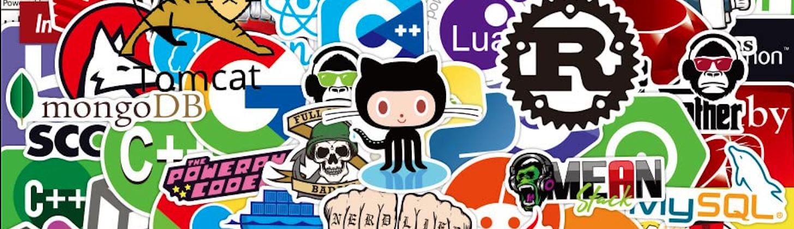

<h1 align="center">Hola, me llamo Lucía</h1>

<h2>Un poco de mí</h2>

Soy una estudiante del Grado Superior de Desarrollo de Aplicaciones Web (DAW).

* Me encanta la música, en mis ratos libres intento mejorar con la guitarra.
* Ahora mismo estoy estudiando en La Senia.
* Siempre me ha llamado la atención el mundo de las páginas webs y como se pueden llegar a desarrolar.

 

  

<h2 align="center">Mis Skills</h2>

  

<h2 align="center">Lenguajes que más uso</h2>

  

